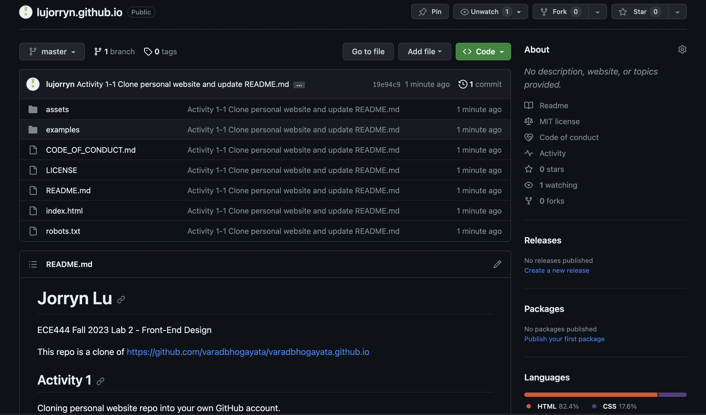
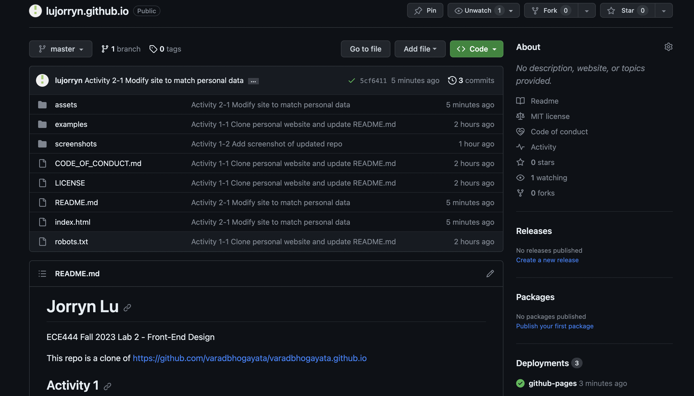
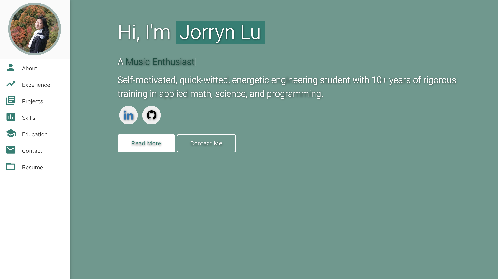
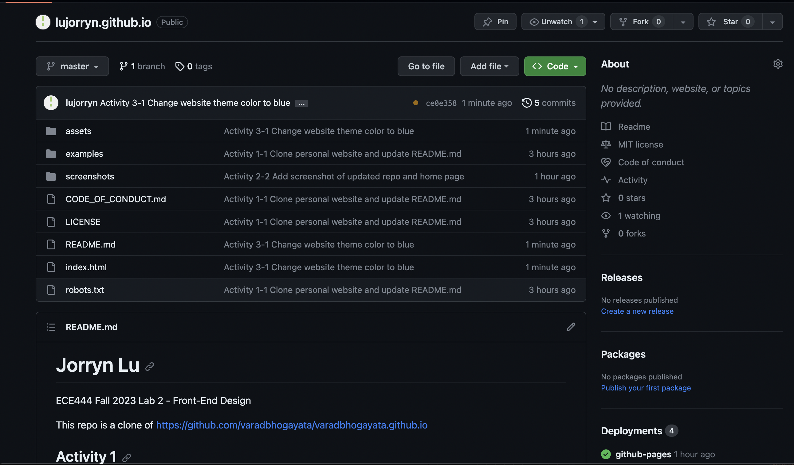
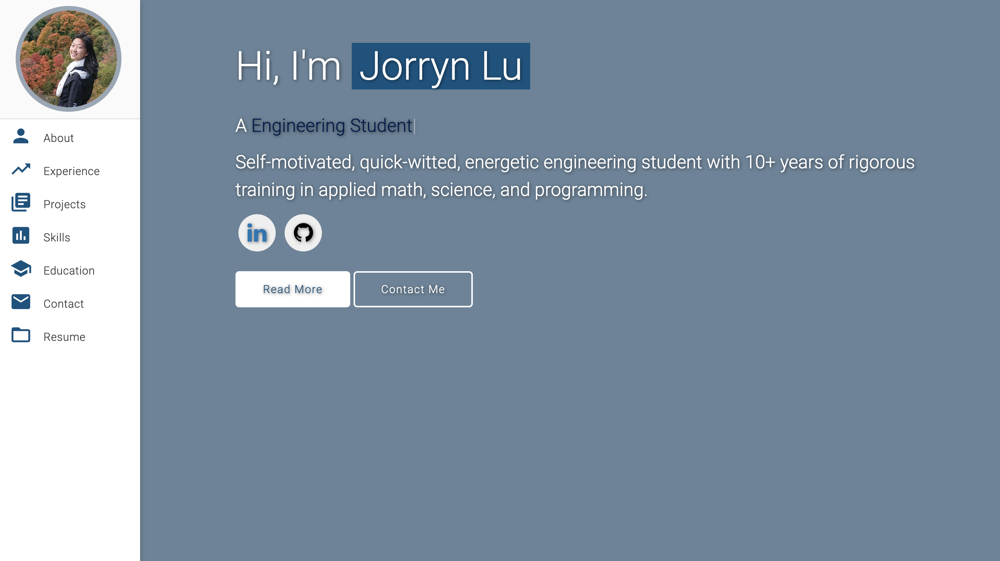

# Jorryn Lu
ECE444 Fall 2023 Lab 2 - Front-End Design

This repo is a clone of https://github.com/varadbhogayata/varadbhogayata.github.io

## Activity 1
Cloning personal website repo into your own GitHub account.

    

## Activity 2
Adding my personal information.

    Screenshot of repo after changing all personal info 
     
    Screenshot of Home Page after changing all personal info 
     

## Activity 3
Changing the theme color

    Screenshot of repo after changing theme color 
     
    Screenshot of Home Page after changing theme color 
     

## Activity 4
Create places travelled section and embed google maps